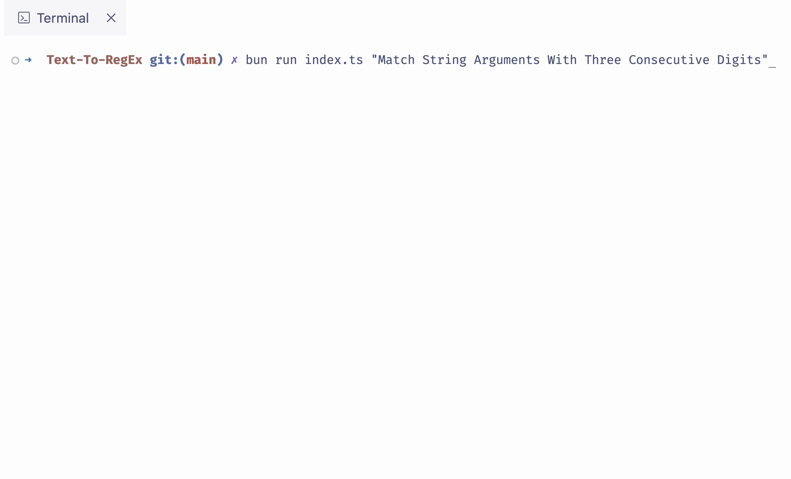

# Text To RegEx: A Tool That Converts Text Descriptions To Regular Expressions

<br>



## Getting Started

The essential procedures required for initiating and configuring the project within your local environment.

### Prerequisites

1. Upgrade the Bun Runtime Toolkit to the latest release version.

    ```sh
    bun upgrade
    ```

### Installation

1. Clone the repository and retrieve it onto your local machine.

    ```sh
    git clone https://github.com/adshyanmatheetharan/Text-To-RegEx.git
    ```
2. Navigate to the 'src' folder directory.

    ```sh
    cd package
    ```
3. Install the required packages and dependencies using the Bun Runtime Toolkit.

    ```sh
    bun install
    ```
4. Enter your environmental variable within the .env file.

    ```js
    OPENAI_API_KEY="Enter Your OpenAI API Key"
    ```
5. Launch the application via the terminal by running the 'index.ts' file.

    ```sh
    bun run index.ts "Enter Your String Arguments"
    ```
## License

This repository is distributed under the MIT License. See `LICENSE` for additional information.
